<p align="center">
    <a href="https://openabcode.com">
    
  </a>
</p>

<p align="center">
  <a href="https://www.npmjs.com/package/@openabcode/coding-agent"></a>
</p>

**OpenABCode** is an LLM-routing coding agent that dynamically routes tasks to the best-suited models:

- Google ecosystem-centric tasks are routed to Gemini.

- Primary code development is routed to Claude.

- Testing and automation scripts are routed to ChatGPT.

<p align="center">
  <a href="https://openabcode.com">
    
  </a>
</p>

To learn more about OpenABCode:

* [Visit openabcode.com](https://openabcode.com), the project website
* [Read the documentation](https://openabcode.com/docs)

## Quick Start

Install with the hosted installer:

```bash
curl -fsSL https://openabcode.com/install.sh | sh
```

Or use a package manager:

```bash
npm install -g @openabcode/coding-agent --ignore-scripts
bun install -g @openabcode/coding-agent
brew install matrixmapai/tap/openabcode
```

Then start OpenABCode:

```bash
openabcode
```

Inside the interactive CLI:

```text
/login         Sign in to OpenABCode or another provider
/model         Select fixed models and Route family models
/route-model   Select the model that classifies Route tasks
/route         Turn automatic task routing on or off
```

When Route is on, the footer shows the configured execution models. Every completed routing decision is also stored in the session JSONL for audit.

## Customizing Route Rules

Route rules, heuristic keywords, file extension mappings, project markers, and the default provider can all be customized in `~/.openabcode/agent/settings.json` (global) or `.openabcode/settings.json` (project-level). When a field is set, it fully replaces the corresponding built-in default.

```json
{
  "router": {
    "rules": {
      "openai": "Test and automation — algorithms, code review, testing, data analysis, scripting",
      "google": "Google ecosystem — Android, Flutter, Firebase, Google Cloud, Kotlin",
      "anthropic": "General development — all code writing, editing, debugging, architecture, UI"
    },
    "keywords": {
      "openai": ["algorithm", "unit test", "benchmark", "data analysis", "pipeline"],
      "google": ["android", "flutter", "dart", "firebase", "gcp"],
      "anthropic": ["refactor", "debug", "architecture", "implement", "fix"]
    },
    "fileExtensions": {
      ".kt": "google",
      ".dart": "google",
      ".rs": "anthropic",
      ".ts": "anthropic",
      ".sh": "openai"
    },
    "projectMarkers": {
      "pubspec.yaml": "google",
      "cargo.toml": "anthropic",
      "package.json": "anthropic",
      "main.tf": "openai"
    },
    "defaultProvider": "anthropic"
  }
}
```

Each field is optional and independent — only configure what you want to override.

## Architecture

```text
User prompt
  -> @openabcode/coding-agent  Route configuration and model selection
  -> @openabcode/ai            Classifier and provider API requests
  -> @openabcode/agent-core    Agent loop, state, and tool execution
```

## All Packages

| Package | Description |
|---------|-------------|
| **[@openabcode/coding-agent](packages/coding-agent)** | Route-first terminal coding agent CLI |
| **[@openabcode/tui](packages/tui)** | Terminal UI renderer behind OpenABCode's interactive editor, model selectors, Route footer, and session views |
| **[@openabcode/ai](packages/ai)** | Unified multi-provider LLM API (OpenAI, Anthropic, Google, etc.) |

## Permissions & Containerization

OpenABCode does not include a built-in permission system for restricting filesystem, process, network, or credential access. By default, it runs with the permissions of the user and process that launched it.

If you need stronger boundaries, containerize or sandbox OpenABCode. See [packages/coding-agent/docs/containerization.md](packages/coding-agent/docs/containerization.md) for three patterns:

- **Gondolin extension**: keep `openabcode` and provider auth on the host while routing built-in tools and `!` commands into a local Linux micro-VM.
- **Plain Docker**: run the whole `openabcode` process in a local container for simple isolation.
- **OpenShell**: run the whole `openabcode` process in a policy-controlled sandbox.

## Contributing

See [CONTRIBUTING.md](CONTRIBUTING.md) for contribution guidelines and [AGENTS.md](AGENTS.md) for project-specific rules (for both humans and agents).

## Development

```bash
npm install --ignore-scripts  # Install all dependencies without running lifecycle scripts
npm run build        # Build all packages
npm run check        # Lint, format, and type check
./test.sh            # Run tests (skips LLM-dependent tests without API keys)
./openabcode-test.sh         # Run openabcode from sources (can be run from any directory)
```

## Supply-chain hardening

We treat npm dependency changes as reviewed code changes.

- Direct external dependencies are pinned to exact versions. Internal workspace packages remain version-ranged.
- `.npmrc` sets `save-exact=true` and `min-release-age=2` to avoid same-day dependency releases during npm resolution.
- `package-lock.json` is the dependency ground truth. Pre-commit blocks accidental lockfile commits unless `OPENABCODE_ALLOW_LOCKFILE_CHANGE=1` is set.
- `npm run check` verifies pinned direct deps, native TypeScript import compatibility, and the generated coding-agent shrinkwrap.
- The published CLI package includes `packages/coding-agent/npm-shrinkwrap.json`, generated from the root lockfile, to pin transitive deps for npm users.
- Release smoke tests use `npm run release:local` to build, pack, and create isolated npm and Bun installs outside the repo before tagging a release.
- Local release installs, documented npm installs, and `openabcode update --self` use `--ignore-scripts` where supported.
- CI installs with `npm ci --ignore-scripts`, and a scheduled GitHub workflow runs `npm audit --omit=dev` plus `npm audit signatures --omit=dev`.
- Shrinkwrap generation has an explicit allowlist for dependency lifecycle scripts; new lifecycle-script deps fail checks until reviewed.

## License

AGPL-3.0

Portions derived from [Pi](https://github.com/earendil-works/pi) remain licensed under the MIT License. See [NOTICE](NOTICE) for attribution.
